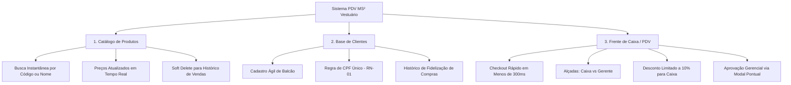

<div align="center">

# 👗 MS² Vestuário — Sistema de Gestão e Ponto de Venda (PDV)

> **Projeto de Conclusão de Curso — Unidade Curricular de Desenvolvimento de Sistemas**  
> Modernização de operação varejista: migração completa do papel para uma aplicação web centralizada.

[](https://nodejs.org/)
[](https://www.typescriptlang.org/)
[](https://react.dev/)
[](https://vitejs.dev/)
[](https://www.mysql.com/)
[](https://tailwindcss.com/)

</div>

---

## 📌 1. Sobre o Projeto

A **MS² Vestuário** é uma loja de roupas e acessórios em plena expansão comercial. Historicamente, sua gestão operava de forma estritamente analógica (controle de estoque em cadernos físicos, comandas de vendas em blocos de papel e cálculo manual com calculadoras).

Esse modelo tradicional gerava gargalos severos:

- **Filas no Caixa:** Demora no atendimento devido à consulta manual em catálogos impressos;
- **Inconsistências Financeiras:** Fechamento diário de caixa demorado e suscetível a erros humanos;
- **Perda de Fidelização:** Ausência de histórico de clientes e hábitos de consumo;
- **Falta de Segurança:** Inexistência de controle sobre descontos aplicados e cancelamentos.

Este sistema foi concebido para digitalizar e centralizar a operação da loja, priorizando **agilidade no atendimento, precisão contábil e simplicidade operacional** para usuários sem perfil técnico.

---

## 🏛️ 2. Os Três Pilares da Solução



1. **Catálogo de Produtos:** Consulta instantânea por código de barras ou descrição, com proteção de integridade referencial.
2. **Base de Clientes:** Cadastro ágil com garantia de unicidade de CPF (RN-01), permitindo histórico de compras e suporte opcional a "Consumidor Final" (RN-06).
3. **Frente de Caixa (PDV):** Registro de itens em tempo real com **snapshot de preço histórico** (RN-04) e controle rigoroso de alçadas de permissão (Caixa vs. Gerente).

---

## 🗄️ 3. Modelagem de Dados e DER

O banco de dados relacional foi modelado na **3ª Forma Normal (3FN)** e implementado em **MySQL 8.0+ (Engine InnoDB)** sob o schema `` `ms2vest.db` ``.

### 🖼️ Diagrama Entidade-Relacionamento

<div align="center">
  
</div>

> Para detalhes das colunas, tipos e constraints, consulte o [Documento Técnico de Modelagem e DER](documentação/s01/02-modelagem-e-der.md) ou a versão vetorial [der-diagrama.svg](documentação/s01/der-diagrama.svg).

### Entidades do Sistema:

- **`usuarios`**: Gestão de operadores (`CAIXA`) e supervisores (`GERENTE`) com senhas em hash bcrypt;
- **`clientes`**: Base de compradores com restrição `UNIQUE` em `cpf`;
- **`produtos`**: Peças e acessórios com controle de preço e inativação lógica (`ativo`);
- **`vendas`**: Registro mestre do cupom (operador, cliente, gerente autorizador, forma de pagamento e totais);
- **`itens_venda`**: Linhas da venda com **snapshot financeiro** (`preco_unitario` imutável).

---

## 🛠️ 4. Stack Tecnológica

| Camada             | Tecnologia                     | Justificativa Técnica                                                                                                  |
| :----------------- | :----------------------------- | :--------------------------------------------------------------------------------------------------------------------- |
| **Frontend**       | React + Vite + TypeScript      | Renderização veloz no navegador do caixa, SPA sem recarregamentos de página e tipagem estrita contra erros de runtime. |
| **Estilização**    | Tailwind CSS                   | Interface utilitária, moderna, responsiva e de alta produtividade sem CSS desorganizado.                               |
| **Roteamento**     | React Router                   | Controle de navegação e proteção de rotas públicas vs. autenticadas.                                                   |
| **Backend**        | Node.js + Express + TypeScript | Arquitetura RESTful organizada em camadas (Controllers, Services, Repositories, Middlewares).                          |
| **Banco de Dados** | MySQL 8.0+ (InnoDB)            | Transações ACID, integridade por Foreign Keys (`RESTRICT` e `CASCADE`) e performance com índices.                      |
| **Validação**      | Zod                            | Schemas de validação estritos na entrada das rotas da API.                                                             |
| **Segurança**      | Bcrypt + JWT + RBAC            | Criptografia de senhas, autenticação stateless e alçadas baseadas em perfil (Caixa vs. Gerente).                       |

---

## 📁 5. Estrutura do Repositório

```text
MS² Vestuario/
├── .gitignore                      # Regras de exclusão de artefatos e credenciais
├── README.md                       # Documentação principal para apresentação e banca
├── database/                       # Scripts e recursos de banco de dados
│   ├── der-apresentacao.jpg        # Imagem visual do DER para slides
│   ├── der-diagrama.svg            # Imagem técnica vetorial do DER
│   ├── schema.sql                  # Script DDL de criação do banco e tabelas
│   └── seeds.sql                   # Carga inicial de testes homologados
├── backend/                        # API RESTful (Node.js + Express + TS)
│   └── src/
│       ├── config/                 # Variáveis de ambiente e pooling de banco
│       ├── controllers/            # Controladores HTTP
│       ├── database/               # Scripts SQL locais
│       ├── middlewares/            # RBAC, autenticação e error handling
│       ├── models/                 # Modelos das entidades
│       ├── repositories/           # Camada de persistência SQL
│       ├── routes/                 # Definição dos endpoints REST
│       ├── services/               # Lógica de negócio e validações
│       ├── types/                  # Tipagens e DTOs TypeScript
│       ├── utils/                  # Utilitários gerais
│       └── validations/            # Schemas Zod
├── frontend/                       # Aplicação Web SPA (React + Vite + TS)
│   └── src/
│       ├── components/             # Componentes reaproveitáveis (botões, inputs, modais)
│       ├── hooks/                  # Hooks customizados
│       ├── layouts/                # Layouts da aplicação
│       ├── pages/                  # Telas (Login, PDV, Produtos, Clientes)
│       ├── routes/                 # Configuração de rotas React Router
│       ├── services/               # Integração HTTP com a API
│       ├── types/                  # Tipagens espelhadas
│       ├── utils/                  # Máscaras e formatação monetária (BRL)
│       └── validations/            # Validações de formulários de tela
├── documentação/                   # Entregáveis oficiais divididos por Sprint
│   ├── s01/                        # Sprint 1: Requisitos, DER, DDL e Imagens
│   ├── s02/                        # Sprint 2: Setup e Camada de Dados
│   ├── s03/                        # Sprint 3: Regras de Negócio e Rotas
│   ├── s04/                        # Sprint 4: Interface de Usuário
│   ├── s05/                        # Sprint 5: Integração e Homologação
│   └── s06/                        # Sprint 6: Slides e Roteiro de Defesa
└── consulta/                       # PDFs e especificações da Unidade Curricular
```

---

## 🚦 6. Roadmap de Desenvolvimento Ágil (Sprints)

| Sprint | Foco da Entrega              |  Status   | Entregáveis                                                           |
| :----: | :--------------------------- | :-------: | :-------------------------------------------------------------------- |
| **01** | **Planejamento e Modelagem** | Concluído | Documento de Requisitos, Regras de Negócio, DER e DDL MySQL.          |
| **02** | **Backend (Fundamentos)**    |  Próximo  | Setup Node.js/TS, conexão com banco, Types e Repositories/Models.     |
| **03** | **Backend (Lógica e API)**   | Planejado | Controllers, Services, alçadas de desconto/cancelamento e rotas REST. |
| **04** | **Frontend (Interface)**     | Planejado | Telas em React/Vite: Login, PDV Caixa, Produtos e Clientes.           |
| **05** | **Integração e Homologação** | Planejado | Conexão API via Fetch/Axios, testes E2E e correção de bugs.           |
| **06** | **Defesa Técnica Final**     | Planejado | Slides de Pitch, Apresentação para Banca e Live Demo.                 |

---

## 🚀 7. Como Executar o Projeto Localmente

> **Regra de Ouro da Demonstração:** O sistema é 100% autônomo e executável localmente, sem dependência de internet ou serviços externos pagos.

### Pré-requisitos

- [Node.js](https://nodejs.org/) (versão 20.x ou superior);
- [MySQL Server](https://dev.mysql.com/downloads/installer/) (versão 8.0+ em execução local);
- Cliente SQL de preferência (MySQL Workbench, DBeaver ou terminal `mysql`).

---

### Passo 1: Inicializar o Banco de Dados

Abra o terminal na raiz do projeto e execute os scripts de criação do schema e carga inicial:

```bash
# 1. Cria a base `ms2vest.db`, tabelas, constraints e índices
mysql -u root -p < database/schema.sql

# 2. Insere a massa de dados inicial (usuários, clientes e catálogo de produtos)
mysql -u root -p < database/seeds.sql
```

_(Ou abra os arquivos `database/schema.sql` e `database/seeds.sql` no seu DBeaver/Workbench e execute os comandos)._

---

### Passo 2: Credenciais Pré-cadastradas para Testes

O script de sementes (`seeds.sql`) já fornece usuários operacionais com senhas criptografadas em bcrypt:

| Perfil      | E-mail               | Senha Padrão | Alçada Operacional                                           |
| :---------- | :------------------- | :----------- | :----------------------------------------------------------- |
| **Gerente** | `gerente@ms2.com.br` | `admin123`   | Acesso irrestrito; aprova cancelamentos e descontos > 10%.   |
| **Caixa**   | `caixa@ms2.com.br`   | `caixa123`   | Operação do PDV, cadastro de clientes e desconto de até 10%. |

---

## 🔒 8. Segurança e Regras de Negócio Implementadas

- **RN-01 (Unicidade de CPF):** Bloqueio estrito no banco e no backend contra cadastros duplicados de clientes.
- **RN-02 (Alçada de Desconto):** Caixa tem autonomia para até 10% de desconto. Descontos superiores exigem credenciais de Gerente via modal sobreposto no PDV.
- **RN-03 (Alçada de Cancelamento):** Cancelamento de transação exige autorização gerencial e registro de justificativa.
- **RN-04 (Snapshot de Preço Histórico):** O preço unitário é gravado na linha do item da venda (`itens_venda.preco_unitario`). Alterações de preço futuras no catálogo não afetam o balanço de vendas passadas.
- **RN-06 (Consumidor Final):** Abertura de checkout permite venda anônima sem travar a fila do caixa.
- **RN-08 (Soft Delete de Produtos):** Peças com histórico de vendas não podem sofrer deleção física (`ON DELETE RESTRICT`), mantendo a integridade contábil.

---

## 🎓 9. Informações Acadêmicas

- **Instituição / Unidade Curricular:** Desenvolvimento de Sistemas
- **Cliente Fictício:** MS² Vestuário
- **Objetivo:** Simulação de engenharia de software aplicada a um cenário real de varejo.
- **Formato de Avaliação:** Pitch Técnico em Slides (15 minutos) + Demonstração Prática ao Vivo (Live Demo).

---

<div align="center">
  <sub>Desenvolvido com foco em excelência técnica, código limpo e padrões de engenharia de software.</sub>
</div>
