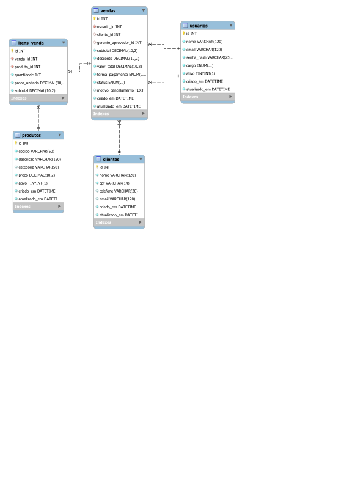
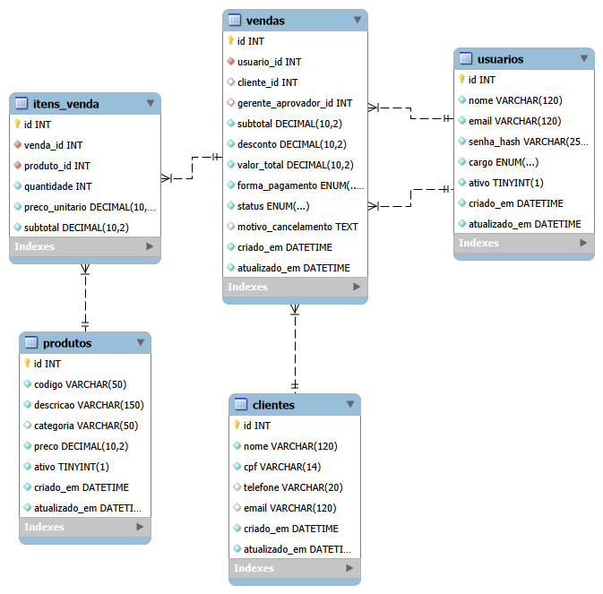
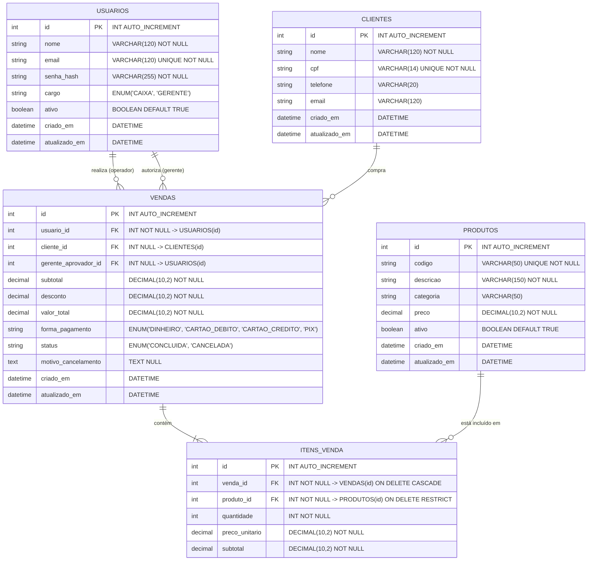

# Modelagem de Dados e Diagrama Entidade-Relacionamento (DER)
**Projeto:** Sistema de Gestão e PDV — MS² Vestuário  
**Sprint:** 01 — Engenharia de Requisitos e Modelagem de Dados  
**Versão:** 1.1.0 (Atualizado para MySQL 8.0+)  
**Data:** 05/10/2026  

---

## 1. Visão Geral da Modelagem

O modelo relacional foi desenhado seguindo as formas normais (1FN, 2FN e 3FN) e adaptado para o banco de dados relacional **MySQL 8.0+ (Engine InnoDB)**, priorizando integridade referencial com chaves estrangeiras, desempenho para leituras instantâneas no balcão e auditoria financeira.

### Entidades Principais:
1. **`usuarios`**: Armazena as contas de acesso dos funcionários, separando perfis (`CAIXA` e `GERENTE`) com senha protegida por hash `bcrypt`.
2. **`clientes`**: Armazena os compradores com garantia de integridade pelo `cpf` único.
3. **`produtos`**: Representa o catálogo de vestuário e acessórios, indexado por código único para busca instantânea no caixa.
4. **`vendas`**: Registra o cabeçalho da transação comercial (cliente, operador, gerente que autorizou desconto/cancelamento, forma de pagamento, totais e status).
5. **`itens_venda`**: Registra cada produto adicionado à venda com seu **snapshot de preço histórico** (`preco_unitario`), quantidade e subtotal da linha.

---

## 2. Imagens do Diagrama Entidade-Relacionamento (DER)

### 2.1. Diagrama Técnico Completo (Vetorial SVG)
> Diagrama vetorial de alta definição com todas as colunas, tipos MySQL, PKs, FKs e cardinalidades:



*(Arquivo disponível em [`documentação/s01/der-diagrama.svg`](file:///c:/Users/NIT0312117/OneDrive%20-%20Firjan/Documentos/MS²%20Vestuario/documentação/s01/der-diagrama.svg) e [`database/der-diagrama.svg`](file:///c:/Users/NIT0312117/OneDrive%20-%20Firjan/Documentos/MS²%20Vestuario/database/der-diagrama.svg))*

---

### 2.2. Diagrama Visual para Apresentação (Slides - Sprint 6)
> Versão estilizada pronta para o Slide 5 da defesa técnica perante a banca:



*(Arquivo disponível em [`documentação/s01/der-apresentacao.png`](file:///c:/Users/NIT0312117/OneDrive%20-%20Firjan/Documentos/MS²%20Vestuario/documentação/s01/der-apresentacao.png) e [`database/der-apresentacao.png`](file:///c:/Users/NIT0312117/OneDrive%20-%20Firjan/Documentos/MS²%20Vestuario/database/der-apresentacao.png))*

---

## 3. Representação em Mermaid



---

## 4. Dicionário de Dados e Regras Estruturais (MySQL 8.0+)

### 4.1. Tabela `usuarios`
| Campo | Tipo MySQL | Nulo? | Chave | Regra / Descrição |
| :--- | :--- | :--- | :--- | :--- |
| `id` | INT AUTO_INCREMENT | Não | PK | Identificador sequencial primário. |
| `nome` | VARCHAR(120) | Não | | Nome completo do funcionário. |
| `email` | VARCHAR(120) | Não | UNIQUE | E-mail corporativo para autenticação. |
| `senha_hash` | VARCHAR(255) | Não | | Hash da senha gerado com bcrypt (salt mínimo 10). |
| `cargo` | ENUM('CAIXA','GERENTE') | Não | | Alçada operacional do usuário. Padrão: `'CAIXA'`. |
| `ativo` | BOOLEAN | Não | | Usuário ativo no sistema (Padrão: `TRUE`). |
| `criado_em` | DATETIME | Não | | Data e hora de criação (`CURRENT_TIMESTAMP`). |
| `atualizado_em`| DATETIME | Não | | Atualização automática (`ON UPDATE CURRENT_TIMESTAMP`). |

### 4.2. Tabela `clientes`
| Campo | Tipo MySQL | Nulo? | Chave | Regra / Descrição |
| :--- | :--- | :--- | :--- | :--- |
| `id` | INT AUTO_INCREMENT | Não | PK | Identificador primário do cliente. |
| `nome` | VARCHAR(120) | Não | | Nome completo do cliente. |
| `cpf` | VARCHAR(14) | Não | UNIQUE | CPF único do cliente (formato padronizado). **RN-01**. |
| `telefone` | VARCHAR(20) | Sim | | Contato WhatsApp para fidelização. |
| `email` | VARCHAR(120) | Sim | | E-mail para contato e comprovantes. |
| `criado_em` | DATETIME | Não | | Data e hora de cadastro. |
| `atualizado_em`| DATETIME | Não | | Data da última alteração. |

### 4.3. Tabela `produtos`
| Campo | Tipo MySQL | Nulo? | Chave | Regra / Descrição |
| :--- | :--- | :--- | :--- | :--- |
| `id` | INT AUTO_INCREMENT | Não | PK | Identificador primário do produto. |
| `codigo` | VARCHAR(50) | Não | UNIQUE | Código de barras ou SKU para busca rápida. |
| `descricao` | VARCHAR(150) | Não | | Descrição comercial da peça. |
| `categoria` | VARCHAR(50) | Sim | | Classificação (Vestuário, Acessórios, etc.). |
| `preco` | DECIMAL(10,2)| Não | CHECK | Preço de venda atual (`preco >= 0.00`). |
| `ativo` | BOOLEAN | Não | | Soft delete (RN-08): produtos inativados não quebram vendas passadas. |
| `criado_em` | DATETIME | Não | | Data de cadastro. |
| `atualizado_em`| DATETIME | Não | | Data de alteração de preço/descrição. |

### 4.4. Tabela `vendas`
| Campo | Tipo MySQL | Nulo? | Chave | Regra / Descrição |
| :--- | :--- | :--- | :--- | :--- |
| `id` | INT AUTO_INCREMENT | Não | PK | Identificador único da venda/cupom. |
| `usuario_id` | INT | Não | FK | Operador de caixa que efetuou a venda (`usuarios.id`). |
| `cliente_id` | INT | Sim | FK | Cliente vinculado à venda (NULL = Consumidor Final). **RN-06**. |
| `gerente_aprovador_id` | INT | Sim | FK | Gerente que autorizou desconto > 10% ou cancelamento. **RN-02 / RN-03**. |
| `subtotal` | DECIMAL(10,2)| Não | | Soma bruta dos itens da venda. |
| `desconto` | DECIMAL(10,2)| Não | CHECK | Valor em reais do desconto concedido. |
| `valor_total` | DECIMAL(10,2)| Não | CHECK | Valor líquido final (`subtotal - desconto`). **RN-07**. |
| `forma_pagamento` | ENUM(...) | Não | | `'DINHEIRO'`, `'CARTAO_DEBITO'`, `'CARTAO_CREDITO'`, `'PIX'`. |
| `status` | ENUM(...) | Não | | `'CONCLUIDA'` ou `'CANCELADA'`. Padrão: `'CONCLUIDA'`. **RN-05**. |
| `motivo_cancelamento`| TEXT | Sim | | Justificativa do cancelamento. |
| `criado_em` | DATETIME | Não | | Data e hora exata da transação. |
| `atualizado_em`| DATETIME | Não | | Data de cancelamento ou atualização. |

### 4.5. Tabela `itens_venda`
| Campo | Tipo MySQL | Nulo? | Chave | Regra / Descrição |
| :--- | :--- | :--- | :--- | :--- |
| `id` | INT AUTO_INCREMENT | Não | PK | Identificador primário do item. |
| `venda_id` | INT | Não | FK | Venda associada (`ON DELETE CASCADE`). |
| `produto_id` | INT | Não | FK | Produto correspondente (`ON DELETE RESTRICT`). |
| `quantidade` | INT | Não | CHECK | Quantidade de peças (`quantidade > 0`). |
| `preco_unitario` | DECIMAL(10,2)| Não | CHECK | **Snapshot de Preço Histórico** no ato da compra. **RN-04**. |
| `subtotal` | DECIMAL(10,2)| Não | CHECK | Quantidade * Preço Unitário (`subtotal >= 0.00`). |

---

## 5. Justificativa das Decisões Técnicas no MySQL

1. **Storage Engine `InnoDB`**:  
   Garante suporte completo a transações **ACID** (`START TRANSACTION`, `COMMIT`, `ROLLBACK`) e integridade referencial com chaves estrangeiras (`FOREIGN KEY`), requisitos fundamentais para consistência financeira de um PDV.
2. **Charset `utf8mb4` com Collation `utf8mb4_unicode_ci`**:  
   Suporta acentuação da língua portuguesa (ex: "Calça", "Boné", "Vestuário") e caracteres especiais sem corrupção de dados.
3. **`DECIMAL(10, 2)` para Valores Monetários**:  
   Evita imprecisões de arredondamento de ponto flutuante (`FLOAT`/`DOUBLE`), garantindo exatidão contábil nos centavos.
4. **Snapshot de Preço (`preco_unitario` em `itens_venda`)**:  
   Garante que futuros reajustes no catálogo não alterem o histórico financeiro de vendas passadas.

---

## 6. Instruções de Execução no MySQL

Todos os scripts agora criam e selecionam o schema automaticamente:

```sql
CREATE DATABASE IF NOT EXISTS `ms2vest.db`
CHARACTER SET utf8mb4 
COLLATE utf8mb4_unicode_ci;

USE `ms2vest.db`;
```

Para rodar via terminal ou ferramentas gráficas:
- **Terminal MySQL:** `mysql -u root -p < database/schema.sql` seguido de `mysql -u root -p < database/seeds.sql`
- **DBeaver / MySQL Workbench:** Abrir [`database/schema.sql`](file:///c:/Users/NIT0312117/OneDrive%20-%20Firjan/Documentos/MS²%20Vestuario/database/schema.sql) e executar tudo (`Ctrl+Alt+X` ou `F5`). Em seguida executar [`database/seeds.sql`](file:///c:/Users/NIT0312117/OneDrive%20-%20Firjan/Documentos/MS²%20Vestuario/database/seeds.sql).

