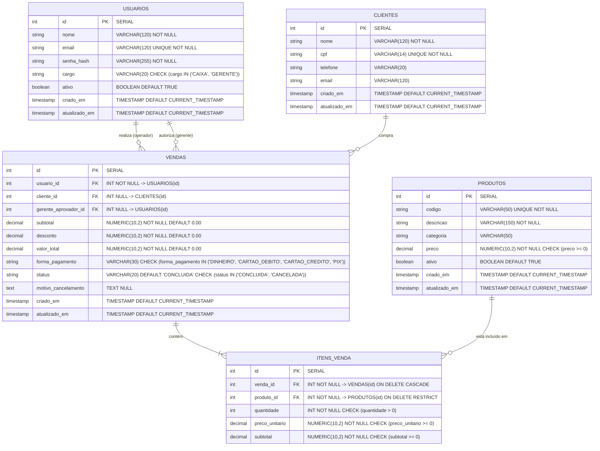

# Modelagem de Dados e Diagrama Entidade-Relacionamento (DER)
**Projeto:** Sistema de Gestão e PDV — MS² Vestuário  
**Sprint:** 01 — Engenharia de Requisitos e Modelagem de Dados  
**Versão:** 1.0.0  
**Data:** 05/10/2026  

---

## 1. Visão Geral da Modelagem

O modelo relacional foi desenhado seguindo as formas normais (1FN, 2FN e 3FN), priorizando integridade referencial, desempenho para leituras rápidas no balcão e auditoria financeira.

### Entidades Principais:
1. **`usuarios`**: Armazena as contas de acesso dos funcionários, separando perfis (`CAIXA` e `GERENTE`) com senha protegida por hash.
2. **`clientes`**: Armazena os compradores com garantia de unicidade pelo `cpf`.
3. **`produtos`**: Representa o catálogo de vestuário e acessórios, indexado por código único para busca instantânea no caixa.
4. **`vendas`**: Registra o cabeçalho da transação comercial (cliente, operador, gerente que autorizou desconto/cancelamento, forma de pagamento, totais e status).
5. **`itens_venda`**: Registra cada produto adicionado à venda com seu **snapshot de preço histórico** (`preco_unitario`), quantidade e subtotal da linha.

---

## 2. Diagrama Entidade-Relacionamento (DER)

Abaixo está a representação conceitual e lógica dos relacionamentos em sintaxe Mermaid:

---

## 3. Dicionário de Dados e Regras Estruturais

### 3.1. Tabela `usuarios`
| Campo | Tipo | Nulo? | Chave | Regra / Descrição |
| :--- | :--- | :--- | :--- | :--- |
| `id` | SERIAL | Não | PK | Identificador sequencial primário. |
| `nome` | VARCHAR(120) | Não | | Nome completo do funcionário. |
| `email` | VARCHAR(120) | Não | UNIQUE | E-mail para autenticação no sistema. |
| `senha_hash` | VARCHAR(255) | Não | | Hash da senha gerado com bcrypt (salt mínimo 10). |
| `cargo` | VARCHAR(20) | Não | CHECK | Restrito a `'CAIXA'` ou `'GERENTE'`. |
| `ativo` | BOOLEAN | Não | | Indica se o usuário pode acessar o sistema (Padrão: `TRUE`). |
| `criado_em` | TIMESTAMP | Não | | Data e hora de criação do registro. |
| `atualizado_em` | TIMESTAMP | Não | | Data e hora da última modificação. |

### 3.2. Tabela `clientes`
| Campo | Tipo | Nulo? | Chave | Regra / Descrição |
| :--- | :--- | :--- | :--- | :--- |
| `id` | SERIAL | Não | PK | Identificador primário do cliente. |
| `nome` | VARCHAR(120) | Não | | Nome completo do cliente. |
| `cpf` | VARCHAR(14) | Não | UNIQUE | CPF único do cliente (formato padronizado). **RN-01**. |
| `telefone` | VARCHAR(20) | Sim | | Contato telefônico / WhatsApp para fidelização. |
| `email` | VARCHAR(120) | Sim | | E-mail para contato e promoções. |
| `criado_em` | TIMESTAMP | Não | | Data e hora de cadastro. |
| `atualizado_em` | TIMESTAMP | Não | | Data e hora da última atualização. |

### 3.3. Tabela `produtos`
| Campo | Tipo | Nulo? | Chave | Regra / Descrição |
| :--- | :--- | :--- | :--- | :--- |
| `id` | SERIAL | Não | PK | Identificador primário do produto. |
| `codigo` | VARCHAR(50) | Não | UNIQUE | Código de barras ou código SKU interno. Busca rápida. |
| `descricao` | VARCHAR(150) | Não | | Descrição comercial da peça (ex: "Camisa Polo Algodão Azul M"). |
| `categoria` | VARCHAR(50) | Sim | | Classificação (ex: "Camisas", "Calças", "Acessórios"). |
| `preco` | NUMERIC(10,2)| Não | CHECK | Preço de venda atual no catálogo (`preco >= 0`). |
| `ativo` | BOOLEAN | Não | | Soft delete: produtos descontinuados não são excluídos. |
| `criado_em` | TIMESTAMP | Não | | Data de cadastro. |
| `atualizado_em` | TIMESTAMP | Não | | Data de alteração de preço/descrição. |

### 3.4. Tabela `vendas`
| Campo | Tipo | Nulo? | Chave | Regra / Descrição |
| :--- | :--- | :--- | :--- | :--- |
| `id` | SERIAL | Não | PK | Identificador único do cupom/venda. |
| `usuario_id` | INT | Não | FK | Operador de caixa responsável pelo registro da venda. |
| `cliente_id` | INT | Sim | FK | Cliente vinculado à venda (NULL = Consumidor Final). **RN-06**. |
| `gerente_aprovador_id` | INT | Sim | FK | ID do Gerente que aprovou desconto especial (>10%) ou cancelamento. |
| `subtotal` | NUMERIC(10,2)| Não | | Soma do valor bruto de todos os itens da venda. |
| `desconto` | NUMERIC(10,2)| Não | CHECK | Valor monetário de desconto concedido (`desconto >= 0`). |
| `valor_total` | NUMERIC(10,2)| Não | CHECK | Valor líquido a pagar (`subtotal - desconto`). **RN-07**. |
| `forma_pagamento` | VARCHAR(30)| Não | CHECK | `'DINHEIRO'`, `'CARTAO_DEBITO'`, `'CARTAO_CREDITO'`, `'PIX'`. |
| `status` | VARCHAR(20) | Não | CHECK | `'CONCLUIDA'` ou `'CANCELADA'`. Padrão: `'CONCLUIDA'`. **RN-05**. |
| `motivo_cancelamento`| TEXT | Sim | | Justificativa obrigatória em caso de cancelamento. **RN-03**. |
| `criado_em` | TIMESTAMP | Não | | Data e hora exata da transação. |
| `atualizado_em` | TIMESTAMP | Não | | Data e hora de atualização de status. |

### 3.5. Tabela `itens_venda`
| Campo | Tipo | Nulo? | Chave | Regra / Descrição |
| :--- | :--- | :--- | :--- | :--- |
| `id` | SERIAL | Não | PK | Identificador do item na venda. |
| `venda_id` | INT | Não | FK | Venda pai (`ON DELETE CASCADE`). |
| `produto_id` | INT | Não | FK | Produto correspondente (`ON DELETE RESTRICT`). |
| `quantidade` | INT | Não | CHECK | Quantidade de peças (`quantidade > 0`). |
| `preco_unitario` | NUMERIC(10,2)| Não | CHECK | **Snapshot de Preço Histórico** no momento da venda. **RN-04**. |
| `subtotal` | NUMERIC(10,2)| Não | CHECK | Quantidade * Preço Unitário (`subtotal >= 0`). |

---

## 4. Justificativa das Decisões Arquiteturais de Banco

1. **Por que a tabela `itens_venda` é obrigatória?**  
   Em um sistema de PDV, uma venda é composta por múltiplos produtos com quantidades variadas (relação 1:N). Além disso, guardar o `preco_unitario` diretamente no item é fundamental: caso uma camiseta aumente de R$ 50 para R$ 60 no mês seguinte, os relatórios contábeis das vendas passadas não podem sofrer reajuste retroativo (**Princípio do Snapshot Financeiro**).

2. **Integridade com `ON DELETE RESTRICT` no `produto_id`**:  
   Se um gerente tentar deletar fisicamente um produto que já foi vendido, o banco de dados rejeita a operação, impedindo que o histórico da venda fique com chave órfã. A inativação deve ser feita via coluna `ativo = false` na tabela de produtos.

3. **Performance com Índices Específicos**:  
   - Índice em `clientes(cpf)` para busca instantânea de clientes no balcão sem travamento;
   - Índice em `produtos(codigo)` para leitura rápida de leitor de código de barras;
   - Índices em `vendas(cliente_id)` e `vendas(usuario_id)` para relatórios de fechamento de caixa e histórico de fidelidade.
