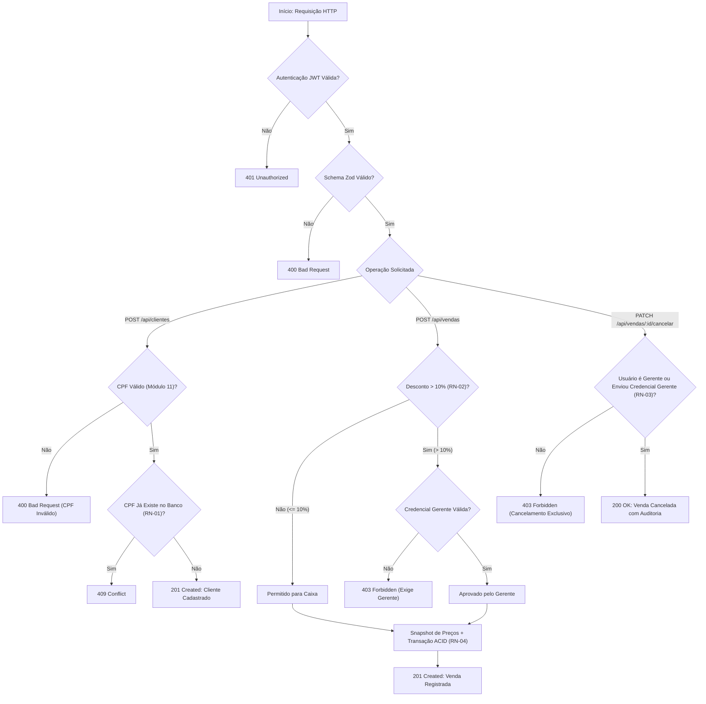

# Documento de Regras de Negócio, Serviços e Rotas da API (Backend)
**Projeto:** Sistema de Gestão e PDV — MS² Vestuário  
**Sprint:** 03 — Lógica de Negócio, Validações e Rotas da API (Backend)  
**Versão:** 1.0.0  
**Data:** 06/10/2026  

---

## 1. Visão Geral da Entrega

Na **Sprint 3**, consolidamos toda a camada de inteligência do sistema, implementando a arquitetura em camadas (Controller - Service - Model - Middleware) no ecossistema Node.js com TypeScript.

O objetivo central desta sprint foi transformar o modelo relacional da Sprint 2 em uma **API RESTful robusta, segura e tipada**, blindada contra entradas inválidas através de esquemas de validação com **Zod**, autenticação com **JWT**, controle de acesso baseado em papéis (**RBAC**) e validação estrita das 4 Regras de Negócio do projeto.

---

## 2. Checklist de Entregáveis da Sprint 3

| Item do Checklist Oficial | Status | Implementação |
| :--- | :---: | :--- |
| **Middlewares de Segurança e Validação** | ✅ Concluído | JWT (`auth.middleware.ts`), RBAC (`rbac.middleware.ts`), Zod (`validation.middleware.ts`) e tratamento global de erros (`error.middleware.ts`). |
| **Serviços de Domínio (Business Logic)** | ✅ Concluído | `AuthService`, `ClienteService`, `ProdutoService` e `VendaService` contendo todas as regras de negócio. |
| **Controladores REST (Controllers)** | ✅ Concluído | `AuthController`, `ClienteController`, `ProdutoController` e `VendaController` com códigos HTTP semânticos (200, 201, 400, 401, 403, 404, 409, 500). |
| **Roteadores da Aplicação** | ✅ Concluído | Rotas modulares em `backend/src/routes/` centralizadas e expostas sob o prefixo `/api`. |
| **Aplicação das Regras RN-01 a RN-04** | ✅ Concluído | Unicidade de CPF com Módulo 11 (RN-01), Teto de 10% de desconto (RN-02), Cancelamento exclusivo por Gerente (RN-03) e Snapshot de preços (RN-04). |
| **Bateria de Testes Automatizados** | ✅ Concluído | Script `test-api.ts` executando 10 cenários de ponta a ponta com 100% de aprovação. |

---

## 3. Matriz de Endpoints da API RESTful

A API base responde no prefixo `/api` e está dividida nos seguintes módulos:

### 3.1. Autenticação e Sessão (`/api/auth`)
| Método | Endpoint | Alçada | Descrição | Status Sucesso |
| :--- | :--- | :--- | :--- | :--- |
| `POST` | `/api/auth/login` | Público | Autentica usuário (Operador de Caixa ou Gerente) e retorna token JWT | `200 OK` |
| `GET` | `/api/auth/me` | Autenticado | Retorna os dados do usuário autenticado no token | `200 OK` |

### 3.2. Clientes (`/api/clientes`)
| Método | Endpoint | Alçada | Descrição | Status Sucesso |
| :--- | :--- | :--- | :--- | :--- |
| `GET` | `/api/clientes` | Autenticado | Lista todos os clientes (com suporte a busca por nome ou CPF via `?busca=`) | `200 OK` |
| `GET` | `/api/clientes/:id` | Autenticado | Busca detalhes de um cliente específico por ID | `200 OK` |
| `GET` | `/api/clientes/cpf/:cpf` | Autenticado | Localiza cliente pelo CPF (higienizado ou formatado) | `200 OK` |
| `POST` | `/api/clientes` | Autenticado | Cadastra novo cliente com validação Módulo 11 e unicidade (RN-01) | `201 Created` |
| `PUT` | `/api/clientes/:id` | Autenticado | Atualiza nome, telefone ou e-mail de um cliente existente | `200 OK` |

### 3.3. Produtos (`/api/produtos`)
| Método | Endpoint | Alçada | Descrição | Status Sucesso |
| :--- | :--- | :--- | :--- | :--- |
| `GET` | `/api/produtos` | Autenticado | Lista todos os produtos ativos do catálogo | `200 OK` |
| `GET` | `/api/produtos/:id` | Autenticado | Busca produto por ID interno | `200 OK` |
| `GET` | `/api/produtos/codigo/:codigo` | Autenticado | Busca rápida de produto pelo código de barras/etiqueta | `200 OK` |
| `POST` | `/api/produtos` | **GERENTE** | Cadastra novo produto no catálogo (exclusivo para Gerentes) | `201 Created` |
| `PUT` | `/api/produtos/:id` | **GERENTE** | Atualiza dados cadastrais ou preço de um produto | `200 OK` |
| `PATCH` | `/api/produtos/:id/status` | **GERENTE** | Ativa ou inativa produto no catálogo comercial | `200 OK` |

### 3.4. Vendas e Checkout PDV (`/api/vendas`)
| Método | Endpoint | Alçada | Descrição | Status Sucesso |
| :--- | :--- | :--- | :--- | :--- |
| `POST` | `/api/vendas` | Autenticado | Registra venda com transação ACID, validação de desconto e snapshot de preços (RN-02 e RN-04) | `201 Created` |
| `GET` | `/api/vendas` | Autenticado | Lista histórico de vendas com dados consolidados | `200 OK` |
| `GET` | `/api/vendas/:id` | Autenticado | Exibe detalhes da venda com lista completa de itens, operador e cliente | `200 OK` |
| `PUT`/`PATCH` | `/api/vendas/:id/cancelar` | Autenticado | Cancela venda homologada exigindo credenciais gerenciais caso operador seja Caixa (RN-03) | `200 OK` |

---

## 4. Implementação das Regras de Negócio Oficiais



### RN-01: Cadastro de Clientes e Unicidade de CPF
* **Validação Prévia:** O schema Zod utiliza o algoritmo oficial de **Módulo 11** para verificar os dois dígitos verificadores do CPF antes de qualquer consulta ao banco.
* **Higienização:** O CPF é normalizado e persistido com máscara nacional (`000.000.000-00`), garantindo padronização no banco `VARCHAR(14)`.
* **Tratamento de Conflito:** Caso o CPF já esteja cadastrado no banco, o serviço lança exceção `AppError` mapeada imediatamente para o código **`409 Conflict`**.

### RN-02: Política de Descontos e Alçada de Decisão
* **Operador de Caixa:** Autorizado a aplicar descontos de até **10,0%** sobre o subtotal da venda.
* **Descontos Acima de 10%:** Bloqueados com código **`403 Forbidden`**, a menos que o payload contenha o objeto `gerente_aprovador` (`email` e `senha`).
* **Auditoria:** O ID do gerente aprovador é gravado permanentemente na coluna `gerente_aprovador_id` da venda.

### RN-03: Cancelamento de Venda Homologada
* **Alçada Exclusiva:** Operadores de Caixa não podem cancelar vendas unilateralmente.
* **Exigência de Justificativa:** O cancelamento exige obrigatoriamente um `motivo` formal.
* **Validação Gerencial:** Caso o usuário logado seja um Caixa, a operação só prossegue mediante envio e validação das credenciais de um Gerente ativo.

### RN-04: Snapshot de Preços Históricos
* Ao registrar os itens na tabela `itens_venda`, o sistema consulta o valor do produto no catálogo no exato instante da venda e grava na coluna `preco_unitario`.
* Caso o preço do produto seja alterado futuramente na tabela `produtos`, o histórico financeiro da venda permanece intacto, garantindo conformidade fiscal e contábil.

---

## 5. Bateria de Testes Automatizados (Evidência de Execução)

A bateria automatizada foi desenvolvida em `backend/src/test-api.ts` e pode ser executada a qualquer momento através do comando:

```bash
npm run test:api
```

### Log Real de Execução (10/10 Cenários Aprovados):

```text
======================================================
🧪 INICIANDO TESTES AUTOMATIZADOS DA API (SPRINT 3)
======================================================

[1/10] Testando Login do Operador de Caixa...
 -> Sucesso! Token de Caixa emitido: [OK] (Usuário: Ana Silva (Caixa))

[2/10] Testando Login do Gerente...
 -> Sucesso! Token de Gerente emitido: [OK] (Usuário: Carlos Mendes (Gerente))

[3/10] Testando Consulta de Produtos...
 -> Sucesso! 8 produtos retornados.

[4/10] Testando Cadastro de Novo Cliente (RN-01 - Módulo 11 Válido)...
 -> Sucesso! Cliente cadastrado com ID 10 e CPF 064.514.702-87.

[5/10] Testando Bloqueio de CPF Duplicado (RN-01 - Conflito 409)...
 -> Sucesso! Bloqueio 409 Conflict acionado corretamente: O CPF '52998224725' já está cadastrado para o cliente 'Mariana Souza'.

[6/10] Testando Venda com Desconto Normal <= 10% (RN-02)...
 -> Sucesso! Venda nº 10 criada. Subtotal: R$ 49.9 | Total Líquido: R$ 45.9

[7/10] Testando Bloqueio de Desconto > 10% sem Gerente (RN-02 - Proibido 403)...
 -> Sucesso! Bloqueio 403 Forbidden acionado corretamente: Desconto de 30.1% ultrapassa o limite permitido para operadores (10%). É necessária autorização gerencial via credenciais do gerente.

[8/10] Testando Venda com Grande Desconto COM Aprovação Gerencial (RN-02)...
 -> Sucesso! Venda nº 11 aprovada pelo Gerente ID 1. Total: R$ 34.9

[9/10] Testando Bloqueio de Cancelamento por Caixa sem Gerente (RN-03 - Proibido 403)...
 -> Sucesso! Bloqueio 403 Forbidden acionado corretamente: Cancelamento de vendas exige alçada gerencial. Forneça e-mail e senha de um Gerente.

[10/10] Testando Cancelamento COM Aprovação Gerencial (RN-03)...
 -> Sucesso! Venda nº 10 cancelada com sucesso. Status atual: CANCELADA

======================================================
🎉 TODOS OS 10 TESTES DA SPRINT 3 PASSARAM COM SUCESSO!
======================================================
```

---

## 6. Conclusão da Sprint 3

Com a conclusão da Sprint 3, a camada de Backend encontra-se **100% pronta, testada e em conformidade** com os requisitos acadêmicos da UC de Desenvolvimento de Sistemas da FIRJAN SENAI.

O sistema está apto para o início da **Sprint 4 (Frontend: Setup e Autenticação)**.
